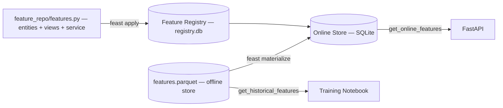
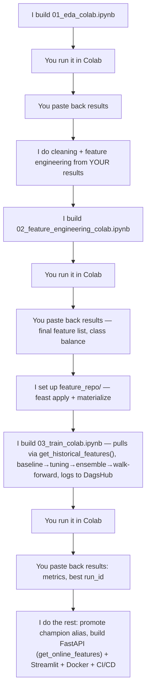
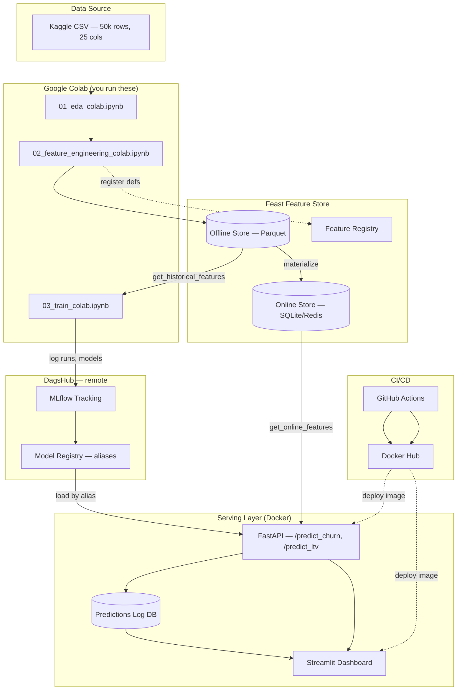
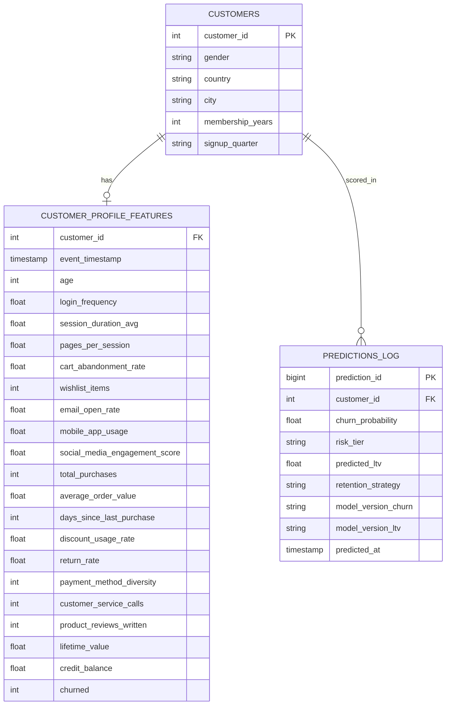
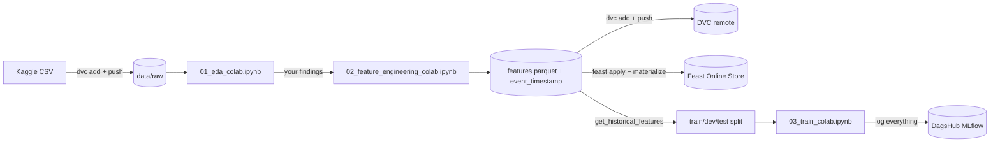
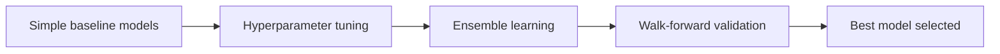
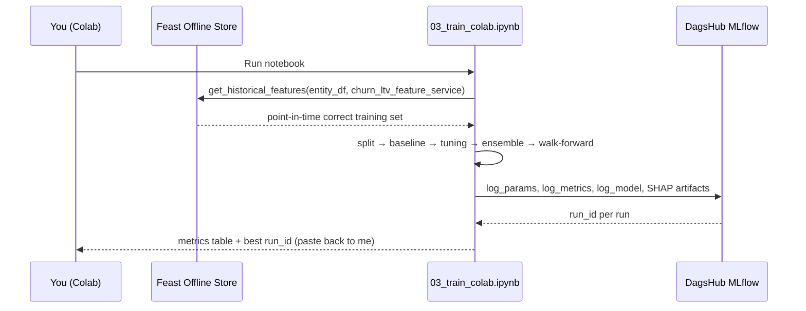
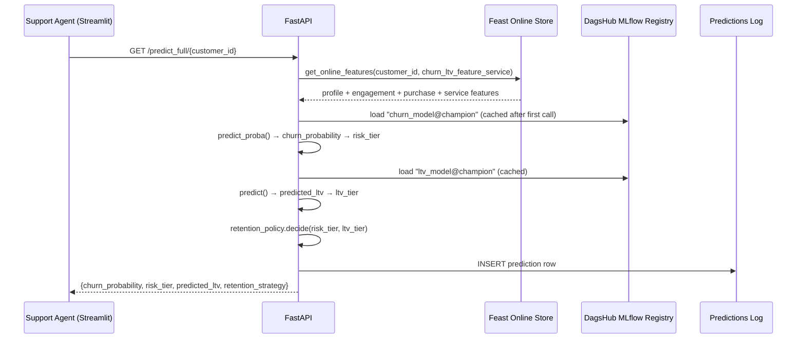
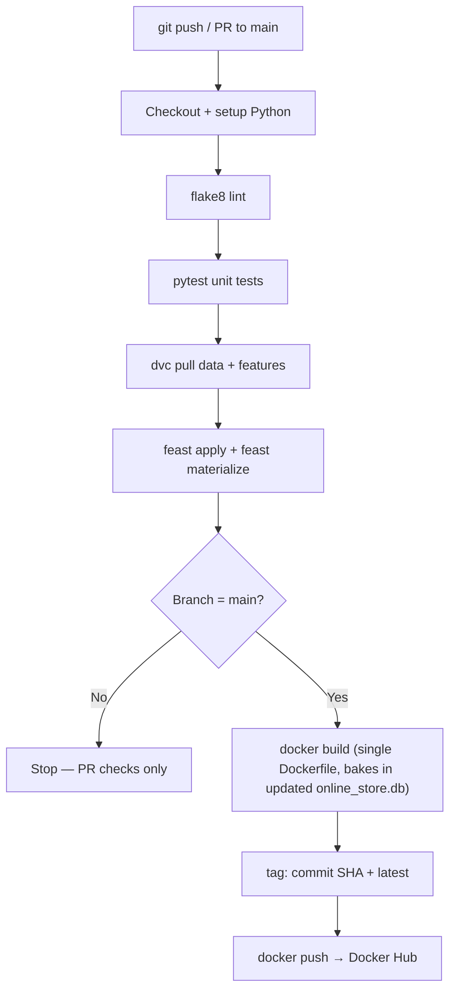
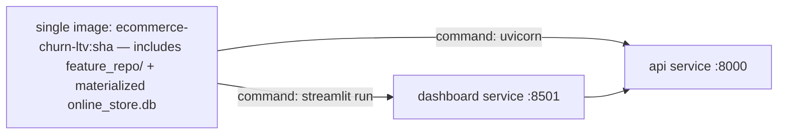

# E-Commerce Dynamic Customer Churn & LTV Predictor — Master Plan

**Status:** Planning document (v2.2 — supersedes v2.1)
**Owner:** You
**Purpose:** Single source of truth for architecture, technology decisions, data model, workflows, and phased execution of this project.

## 0. Changelog

| Version | Change | Reason |
|---|---|---|
| v2.2 | **Dataset confirmed from your actual uploaded file**, not just a search mirror — 2 corrections made: column is `Returns_Rate` (not `Return_Rate`), and the raw file has **no `Customer_ID` column** at all | Verified real column names/dtypes directly from your uploaded CSV |
| v2.2 | `Customer_ID` will be **synthesized** from row index in Phase 1, not read from source | Feast and the ERD both need an entity key; the raw file doesn't have one |
| v2.3 | Section 2 updated with **real Phase 2 EDA results** (missingness, imbalance ratio, correlations, multicollinearity, quarter split) | Your actual notebook run — no more placeholder numbers |
| v2.3 | Imbalance handling made concrete: **class-weighting is primary** (2.46:1 is mild, not severe), SMOTE kept only as a comparison run | Data-driven decision instead of a generic "compare both and see" |
| v2.3 | Walk-forward validation fixed at **exactly 3 expanding-window folds** (Q1→Q2, Q1+Q2→Q3, Q1+Q2+Q3→Q4), final test set = Q4 | Only 4 signup quarters exist in the real data |
| v2.1 | **Feast reinstated as core** — both offline store (training) and online store (serving), no longer optional | Your instruction: "we will use feast for both offline and online storage" |
| v2.1 | New standalone **Phase 4 — Feature Store**, inserted between Feature Engineering and Modeling | Feast now sits on the critical path, not a side addition |
| v2.1 | Training notebook now pulls data via `store.get_historical_features()`, serving pulls via `store.get_online_features()` | This is the actual point of using Feast — one definition, two consumption paths |
| v2.0 | Dataset swapped to 50,000-row / 25-column Kaggle set with real `Lifetime_Value` column | You required >30k rows and a real, not proxy, LTV target |
| v2.0 | Explicit train/dev/test split before any tuning | Your requirement |
| v2.0 | Modeling funnel: baseline → hyperparameter tuning → ensemble → walk-forward validation | Matches your specified order |
| v2.0 | MLflow moved to **DagsHub-hosted** remote tracking + registry | Your instruction: "upload best model to MLflow, do it remote using DagsHub" |
| v2.0 | Added Human-in-the-Loop Notebook Protocol (Section 4→ now Section 5) | Formalizes: I build notebook → you run in Colab → you paste results → I do next step |

---

## 1. Business Problem & ML Framing

Two supervised models, one rule engine:

| # | Task | Type | Target column | Output |
|---|------|------|--------|--------|
| 1 | Churn prediction | Binary classification | `Churned` (0/1) | `churn_probability`, `risk_tier` |
| 2 | LTV prediction | Regression | `Lifetime_Value` (real column) | `predicted_ltv`, `ltv_tier` |
| 3 | Retention decision | Rule engine (not ML) | combination of 1+2 | `retention_strategy` |

---

## 2. Confirmed Dataset

**Chosen:** *"Ecommerce Customer Behavior Dataset"* (Kaggle, dhairyajeetsingh) — 50,000 rows, 25 columns, real `Churned` and `Lifetime_Value` columns. **Verified directly against your uploaded file's actual column list and dtypes** (not just the Kaggle listing text).

| Group | Columns |
|---|---|
| Demographics (5) | `Age`, `Gender`, `Country`, `City`, `Membership_Years` |
| Platform Engagement (8) | `Login_Frequency`, `Session_Duration_Avg`, `Pages_Per_Session`, `Cart_Abandonment_Rate`, `Wishlist_Items`, `Email_Open_Rate`, `Mobile_App_Usage`, `Social_Media_Engagement_Score` |
| Purchase Behavior (6) | `Total_Purchases`, `Average_Order_Value`, `Days_Since_Last_Purchase`, `Discount_Usage_Rate`, `Returns_Rate`, `Payment_Method_Diversity` |
| Customer Service (3) | `Customer_Service_Calls`, `Product_Reviews_Written`, `Lifetime_Value` |
| Financial & Status (3) | `Credit_Balance`, `Churned` (target), `Signup_Quarter` |

That's the real 25. **No `Customer_ID` column exists in the raw file** — every other version of this dataset's description mentions one, but yours doesn't have it. Phase 1 synthesizes one from the row index (`df.reset_index()` → `Customer_ID`) since Feast and the ERD both need an entity key.

### 2.1 Real EDA Findings (from your executed Phase 2 notebook — not estimates)

| Finding | Value |
|---|---|
| Shape | 50,000 rows × 26 cols (25 + synthesized `Customer_ID`) |
| Exact duplicate rows | 0 |
| Columns with missing values | 14, ranging **0.34%** (`Customer_Service_Calls`) to **12.00%** (`Social_Media_Engagement_Score`). No missing categoricals. |
| `Churned` balance | 71.1% active (35,550) / 28.9% churned (14,450) → **imbalance ratio 2.46 : 1 (mild/moderate)** |
| Strongest churn correlations | `Customer_Service_Calls` +0.291, `Cart_Abandonment_Rate` +0.278, `Days_Since_Last_Purchase` +0.153, `Pages_Per_Session` -0.232, `Session_Duration_Avg` -0.228 |
| `Lifetime_Value` vs `Churned` | -0.011 — essentially uncorrelated; churners and non-churners carry similar historical LTV, which is why combining churn risk + LTV in the retention rule (Section 11.4) adds real information |
| Multicollinearity | `Session_Duration_Avg`, `Pages_Per_Session`, `Mobile_App_Usage`, `Login_Frequency`, `Wishlist_Items`, `Email_Open_Rate`, `Social_Media_Engagement_Score`, `Cart_Abandonment_Rate` mutually correlated 0.6–0.76 |
| `Signup_Quarter` | Exactly 4 values, evenly split (~12,450–12,560 each) |
| `Lifetime_Value` distribution | Mean 1440.63, median 1243.42, max 8987.24 — right-skewed, `log1p` transform recommended at training time |
| Outliers (IQR) | Up to ~4.9% of rows on `Payment_Method_Diversity` (likely an IQR artifact on a low-cardinality field, not real anomalies); nothing large enough to justify dropping rows |

**Decisions this drives (detailed in Sections 8–9):** median imputation for the 14 columns; class-weighting as the primary imbalance strategy with SMOTE as a comparison, not a default; no outlier removal, only model-specific scaling later; exactly 3 walk-forward folds with Q4 as the final held-out test quarter.

**One new technical note (relevant now that Feast is core):** this dataset is a **single snapshot per customer** — one row each, no repeated observations over time. Feast's offline store requires a timestamp column for point-in-time joins even so; Phase 3 adds an `event_timestamp` column (set to a fixed ingestion date) purely to satisfy that schema requirement. Said plainly: there's no real temporal multiplicity to be point-in-time-correct *about* yet — the mechanism is there and used correctly, but its main value here is architectural (a live, growing dataset could add new snapshots later without a redesign), not solving a leakage problem that doesn't currently exist in a single-snapshot file.

---

## 3. Tech Stack

| Layer | Chosen | Why |
|---|---|---|
| Core language | Python 3.11 | One language across ML + API + dashboard |
| Classifier | **CatBoost** (primary) + **RandomForest** (baseline) | Native categorical handling |
| Imbalance handling | **SMOTE** + class-weighting | Compared side by side, not assumed |
| **Feature store** | **Feast — offline (Parquet) + online (SQLite, Redis-upgradeable)** | One feature definition, two consumers: point-in-time correct pulls for training, low-latency lookups for serving — this is now load-bearing, not optional |
| Experiment tracking + registry | **MLflow, hosted remotely on DagsHub** | Free hosted tracking server + registry per repo, nothing to self-host |
| Compute (training) | **Google Colab** | Free compute, notebook-driven |
| Serving API | **FastAPI** | Async, auto docs, Pydantic validation |
| Internal UI | **Streamlit** | Fast internal dashboard |
| CI/CD | **GitHub Actions** | Free at this scale |
| Container registry | **Docker Hub** | Per your spec |
| Data versioning | **DVC + Git** | Binaries out of Git history, pipeline reproducibility |

---

## 4. Feature Store Design (Feast) — Core, Not Optional

### 4.1 Entity & Data Source

- **Entity:** `customer`, join key `customer_id`.
- **Source:** `data/processed/features.parquet` (output of Phase 3), with an added `event_timestamp` column (see Section 2 note).
- **Offline store:** local file/Parquet (`provider: local`).
- **Online store:** SQLite by default (zero extra infra); config-only swap to **Redis** later for concurrent low-latency production reads — one line in `feature_store.yaml`, no code change.

### 4.2 Feature Views

| Feature View | Columns |
|---|---|
| `customer_profile_features` | `Age`, `Gender`, `Country`, `City`, `Membership_Years`, `Signup_Quarter` |
| `customer_engagement_features` | `Login_Frequency`, `Session_Duration_Avg`, `Pages_Per_Session`, `Cart_Abandonment_Rate`, `Wishlist_Items`, `Email_Open_Rate`, `Mobile_App_Usage`, `Social_Media_Engagement_Score` |
| `customer_purchase_features` | `Total_Purchases`, `Average_Order_Value`, `Days_Since_Last_Purchase`, `Discount_Usage_Rate`, `Returns_Rate`, `Payment_Method_Diversity` |
| `customer_service_features` | `Customer_Service_Calls`, `Product_Reviews_Written`, `Lifetime_Value`, `Credit_Balance` |

**Feature Service:** `churn_ltv_feature_service` bundles all four views — one `get_historical_features()` / `get_online_features()` call instead of four.

### 4.3 Apply & Materialize Flow



`feast apply` and `feast materialize` run once locally after Phase 3, and again in CI/CD (Section 12) whenever `features.parquet` changes on `main`, so the online store never silently goes stale.

---

## 5. Human-in-the-Loop Notebook Protocol



**Rule:** I never write Phase-N code based on assumed results — only on what you actually paste back from running Phase N-1.

---

## 6. High-Level System Architecture



---

## 7. Data Architecture

### 7.1 ERD



`CUSTOMER_PROFILE_FEATURES` here is the conceptual union of the four Feast feature views in Section 4.2 — split there for Feast's own organization, shown as one row per customer here for clarity.

### 7.2 Data Flow



### 7.3 Data Versioning (DVC)

Git tracks code + `.dvc` pointers; DVC tracks CSV/Parquet/model binaries. DagsHub can host both the DVC remote and the MLflow server on the same repo — one login, two URL suffixes (`.dvc` / `.mlflow`).

---

## 8. Feature Engineering (Phase 3 — done, locked from real results)

Final engineered features, each justified by a specific number from Section 2.1, not a generic RFM template:

| Feature | Built from | Why (grounded in real EDA numbers) |
|---|---|---|
| `Recency` | `Days_Since_Last_Purchase` | Core RFM signal |
| `Frequency` | `Total_Purchases` | Core RFM signal |
| `Monetary_Proxy` | `Average_Order_Value × Total_Purchases` | Core RFM signal, cross-checked vs real `Lifetime_Value` |
| `Tenure_Normalized_Activity` | `Total_Purchases / (Membership_Years + 1)` | Long-tenure-but-suddenly-quiet detector |
| `Engagement_Composite` | Mean of z-scored `Session_Duration_Avg`, `Pages_Per_Session`, `Mobile_App_Usage`, `Login_Frequency`, `Wishlist_Items`, `Email_Open_Rate`, `Social_Media_Engagement_Score` | Directly addresses the 0.6–0.76 multicollinear cluster found in EDA; mainly helps the Logistic Regression baseline, kept alongside (not replacing) the raw columns since trees handle redundancy fine |
| `Dissatisfaction_Composite` | Mean of z-scored `Customer_Service_Calls` + `Cart_Abandonment_Rate` | Built from the **two strongest real churn correlates** (+0.291, +0.278); `Returns_Rate` (+0.054) was too weak to add here |
| `event_timestamp` | Fixed ingestion date, added here | Required by Feast's data source schema (Section 2 note) |

**Missing values:** median-imputed for all 14 columns identified in Section 2.1 — median chosen over mean because several are right-skewed. All 14 are 0% missing after this phase, confirmed by an assertion in the notebook.

**Outliers:** none dropped (Section 2.1 reasoning — nothing severe enough, and `Payment_Method_Diversity`'s high IQR count is a low-cardinality artifact, not a real anomaly). Any capping/scaling a specific model needs (mainly Logistic Regression) happens inside that model's own pipeline in Phase 5, not baked into the shared table.

Categoricals (`Gender`, `Country`, `City`, `Signup_Quarter`) stay native, unencoded — CatBoost handles them directly; other models encode inside their own Phase 5 pipeline.

---

## 9. Modeling Strategy (Phase 5)

### 9.1 Data Retrieval & Splitting

- Training set pulled via `store.get_historical_features(entity_df=..., features=churn_ltv_feature_service).to_df()` — not a raw `pd.read_parquet`, so the training path exercises the same feature definitions serving will use later.
- **Train / Dev / Test**, stratified on `Churned`, default 70/15/15 (adjustable after real class-balance numbers from EDA). Test set touched once, at the end.

### 9.2 Funnel



1. **Baselines** — Logistic Regression, default Decision Tree, default RandomForest/CatBoost.
2. **Hyperparameter tuning** — GridSearchCV/RandomizedSearchCV or Optuna on the dev split.
3. **Ensemble** — Voting/stacking across tuned models.
4. **Walk-forward validation** — real `Signup_Quarter` distribution only has 4 values, evenly split, giving exactly **3 expanding-window folds**, fixed in Phase 3 and reused as-is here:

   | Fold | Train on | Validate on |
   |---|---|---|
   | 1 | Q1 | Q2 |
   | 2 | Q1 + Q2 | Q3 |
   | 3 | Q1 + Q2 + Q3 | Q4 |

   **Final test set = Q4**, held out and touched exactly once, consistent with the forward-in-time logic (not a random 15% slice).

**Imbalance handling — data-driven, not generic:** real ratio is 2.46:1 (mild/moderate). **Class-weighting is primary** (`class_weight='balanced'` / CatBoost `auto_class_weights='Balanced'`, using the exact weights computed in Phase 3: see notebook output). **SMOTE is trained as a comparison run only**, expected to perform similarly or slightly worse given how mild this imbalance actually is — it's tested, not assumed to win, and fit only on the training fold either way.

### 9.3 LTV Regression

Same funnel, same `churn_ltv_feature_service` pull, target = real `Lifetime_Value` column. Given the confirmed right-skew (mean 1440.63 vs median 1243.42, max 8987.24), train on `log1p(Lifetime_Value)` and invert predictions with `expm1` before reporting. Metric: RMSE/MAE relative to mean `Lifetime_Value`, computed on the inverted (real-scale) predictions.

### 9.4 Explainability

SHAP values for both final models, logged as DagsHub MLflow artifacts.

---

## 10. Experiment Tracking & Model Registry (DagsHub-hosted MLflow)

### 10.1 Setup

```python
import dagshub
dagshub.init(repo_owner="<your-dagshub-username>", repo_name="<your-repo-name>", mlflow=True)
# tracking URI resolves to https://dagshub.com/<user>/<repo>.mlflow
```

Credentials via `MLFLOW_TRACKING_USERNAME` / `MLFLOW_TRACKING_PASSWORD` (DagsHub token), never hardcoded.

### 10.2 Registry — aliases, not legacy stages

MLflow deprecated registry "stages" (Staging/Production) from v2.9 onward in favor of **aliases + tags**; DagsHub's registry runs standard MLflow underneath, so:

- `churn_model` / `ltv_model`, versions tagged `@champion` (serving) / `@candidate` (pending).
- `app/model_loader.py` resolves `models:/churn_model@champion` — promotion is a one-line alias move, no redeploy.

### 10.3 Training Workflow



---

## 11. Serving Layer (Phase 6)

### 11.1 FastAPI

| Endpoint | Method | Description |
|---|---|---|
| `/predict_churn/{customer_id}` | GET | `get_online_features()` from Feast → `churn_model@champion` from DagsHub → `churn_probability` + `risk_tier` |
| `/predict_ltv/{customer_id}` | GET | Same feature fetch → `ltv_model@champion` → `predicted_ltv` + `ltv_tier` |
| `/predict_full/{customer_id}` | GET | Both models + retention rule, logs to `PREDICTIONS_LOG` |
| `/high_risk_customers` | GET | Reads `PREDICTIONS_LOG` for the dashboard |
| `/health` | GET | Liveness check |

### 11.2 Prediction Sequence



### 11.3 Streamlit

- Single-customer lookup → `/predict_full/{id}` → probability + SHAP top features + action.
- High-risk cohort table → `/high_risk_customers`.

### 11.4 Retention Rule Engine

| Risk Tier | LTV Tier | Action |
|---|---|---|
| High | High | Personal agent callback + high-value discount |
| High | Low | Automated small coupon |
| Medium | High | Proactive email + moderate cashback |
| Medium | Low | Automated email nudge |
| Low | Any | No action |

---

## 12. CI/CD & Containerization

### 12.1 GitHub Actions



Secrets: `DOCKERHUB_USERNAME`, `DOCKERHUB_TOKEN`, `MLFLOW_TRACKING_USERNAME`, `MLFLOW_TRACKING_PASSWORD`.

### 12.2 Docker



Still **one Dockerfile**, two `command:` overrides in `docker-compose.yml` (`api`, `dashboard`). The Feast online store SQLite file is materialized in CI (step F above) and copied into the image at build time — since there's no live event stream, "freshness" of the online store means "as of the last merge to `main`," and that's stated plainly, not oversold as real-time.

---

## 13. Final Repository Structure

**What each top-level folder actually is** (this needed spelling out):

| Folder | What it is | Why it's separate |
|---|---|---|
| `feature_repo/` | **Feast's own config folder** — not a generic name I made up. Feast's CLI (`feast apply`) expects entities/feature-views/`feature_store.yaml` in one folder it treats as "the repo." Standard convention when you run `feast init`. |
| `scripts/` | **One-off CLI utility scripts** — things you *run*, not things you *import*. Data download, scaffold, Feast apply/materialize wrapper. |
| `src/` | **Importable Python modules** — things `app/` and the notebooks import as code, not scripts you run directly. |
| `app/` | The two things users actually run: FastAPI + Streamlit. |

```
ecommerce-churn-ltv-predictor/
├── .github/
│   └── workflows/
│       └── mlops_pipeline.yml
├── .dvc/
│   └── config
├── data/
│   ├── raw/
│   │   └── ecommerce_customer_behavior.csv.dvc
│   └── processed/
│       └── features.parquet.dvc
├── feature_repo/
│   ├── feature_store.yaml
│   ├── entities.py
│   ├── data_sources.py
│   ├── features.py
│   └── feature_services.py
├── scripts/
│   ├── scaffold.sh
│   ├── download_data.sh
│   └── feast_setup.sh
├── src/
│   ├── config.py
│   ├── data_cleaning.py
│   ├── evaluate.py
│   └── retention_policy.py
├── app/
│   ├── main.py
│   ├── schemas.py
│   ├── feature_client.py
│   ├── model_loader.py
│   └── dashboard.py
├── tests/
│   ├── test_features.py
│   └── test_api.py
├── notebooks/
│   ├── 01_eda_colab.ipynb
│   ├── 02_feature_engineering_colab.ipynb
│   └── 03_train_colab.ipynb
├── logs/
│   └── pipeline_execution.log
├── .env
├── .env.example
├── .gitignore
├── .dockerignore
├── Dockerfile
├── docker-compose.yml
├── requirements.txt
├── dvc.yaml
├── params.yaml
└── README.md
```

Still exactly one `Dockerfile`, one `requirements.txt`, one `README.md` at root.

---

## 14. Configuration & Environment Files

### 14.1 `.env.example`

```env
# App
ENV=development
API_HOST=0.0.0.0
API_PORT=8000
LOG_LEVEL=INFO

# Feast
FEAST_REPO_PATH=./feature_repo
FEAST_ONLINE_STORE_TYPE=sqlite

# DagsHub / MLflow (remote)
DAGSHUB_REPO_OWNER=
DAGSHUB_REPO_NAME=
MLFLOW_TRACKING_URI=https://dagshub.com/<owner>/<repo>.mlflow
MLFLOW_TRACKING_USERNAME=
MLFLOW_TRACKING_PASSWORD=
MLFLOW_EXPERIMENT_CHURN=churn_classification
MLFLOW_EXPERIMENT_LTV=ltv_regression
MODEL_NAME_CHURN=churn_model
MODEL_NAME_LTV=ltv_model
MODEL_ALIAS=champion

# Business thresholds
CHURN_RISK_HIGH_THRESHOLD=0.7
CHURN_RISK_MEDIUM_THRESHOLD=0.4

# DVC remote (can also be DagsHub)
DVC_REMOTE_URL=

# Docker Hub (GitHub Actions secrets only)
DOCKERHUB_USERNAME=
DOCKERHUB_TOKEN=
```

### 14.2 `.gitignore`

```gitignore
__pycache__/
*.pyc
.venv/
venv/
.env
data/raw/*.csv
data/processed/*.parquet
!data/**/*.dvc
feature_repo/data/registry.db
feature_repo/data/online_store.db
mlruns/
logs/*.log
.DS_Store
.vscode/
.idea/
```

### 14.3 `.dockerignore`

```dockerignore
.git
.github
.dvc
venv/
.venv/
__pycache__/
tests/
notebooks/
scripts/
data/raw
logs/*.log
.env
.env.example
README.md
```

---

## 15. Phased Roadmap

| Phase | Name | Deliverable | Who runs it | Exit Criteria |
|---|---|---|---|---|
| 0 | Setup | Repo scaffold, `git init`, `dvc init` | Me + you | Clean `git status`/`dvc status` |
| 1 | Data acquisition | Dataset downloaded, DVC-tracked | You download, I script `dvc add` | Schema matches Section 2 |
| 2 | EDA | `01_eda_colab.ipynb` | I build → you run → you paste results | Class balance, missingness, quarter distribution known |
| 3 | Cleaning + Feature Engineering | `02_feature_engineering_colab.ipynb`, adds `event_timestamp` | I build (from Phase 2 results) → you run → you paste results | `features.parquet` produced, feature list locked |
| 4 | **Feature Store** | `feature_repo/` — entities, 4 feature views, feature service, `feast apply` + `feast materialize` | Me | `get_historical_features()` and `get_online_features()` both return expected columns for a test customer |
| 5 | Modeling | `03_train_colab.ipynb` — baseline→tuning→ensemble→walk-forward | I build (from Phase 4 setup) → you run → you paste results | Best churn + LTV run_ids identified |
| 6 | Registry promotion + Serving | FastAPI + Streamlit | Me | `@champion` alias set; `/predict_full/{id}` works end-to-end via Feast online store |
| 7 | CI/CD + Docker | GitHub Actions, single Dockerfile | Me | PR triggers lint+test; merge to main applies+materializes Feast, builds & pushes image |
| 8 | Documentation | Final README | Me | New dev can `docker compose up` and hit `/docs` cold |
| 9 | Monitoring (stretch) | Drift check script | Me | Documented, not blocking |

---

## 16. Risks & Mitigations

| Risk | Impact | Mitigation |
|---|---|---|
| Dataset schema on download doesn't exactly match Section 2 | EDA notebook breaks | Confirm columns immediately after download |
| Single-snapshot data + Feast's timestamp requirement | Could look like fake "time-series" data if not explained | Section 2/8 state plainly it's a fixed ingestion timestamp, not real event time |
| Online store only as fresh as the last CI merge (no live stream) | Could be mistaken for real-time | README + dashboard state clearly this is batch-materialized, not live |
| Colab session disconnects mid-training | Lost progress | Log to DagsHub MLflow incrementally, not only at the end |
| SMOTE overfits on synthesized minority samples | Inflated validation metrics | Compare against class-weighting; never touch test set with SMOTE |
| Walk-forward folds sparse if `Signup_Quarter` isn't evenly spread | Unstable folds | Check quarter distribution in Phase 2 EDA before fixing fold count |
| Feast adds real operational surface area (registry.db, online_store.db as build artifacts) | More moving parts for a solo project | Kept to local file/SQLite backends, no managed cluster — still lightweight despite being core now |

---

## 17. Success Metrics / KPIs

| Metric | Target | Measured where |
|---|---|---|
| Churn ROC-AUC | ≥ 0.85 on held-out test | DagsHub MLflow |
| Churn F1 (churn class) | ≥ 0.65 | DagsHub MLflow |
| Churn model stable across walk-forward folds | No fold drops >10% vs. average | Walk-forward output |
| LTV RMSE | < 20% of mean `Lifetime_Value` | DagsHub MLflow |
| API latency, `/predict_full` | < 300ms p95 (Feast online store + cached model) | Load test, Phase 6 |
| CI pipeline | Green on every PR | GitHub Actions |

---

## 18. Appendix — Confirmed Dataset Schema Reference

`Age`, `Gender`, `Country`, `City`, `Membership_Years`, `Login_Frequency`, `Session_Duration_Avg`, `Pages_Per_Session`, `Cart_Abandonment_Rate`, `Wishlist_Items`, `Total_Purchases`, `Average_Order_Value`, `Days_Since_Last_Purchase`, `Discount_Usage_Rate`, `Returns_Rate`, `Email_Open_Rate`, `Customer_Service_Calls`, `Product_Reviews_Written`, `Social_Media_Engagement_Score`, `Mobile_App_Usage`, `Payment_Method_Diversity`, `Lifetime_Value`, `Credit_Balance`, `Churned`, `Signup_Quarter` — 25 columns, exactly as they appear in your uploaded file. `Customer_ID` is not in the source; it's added in Phase 1 from the row index.
